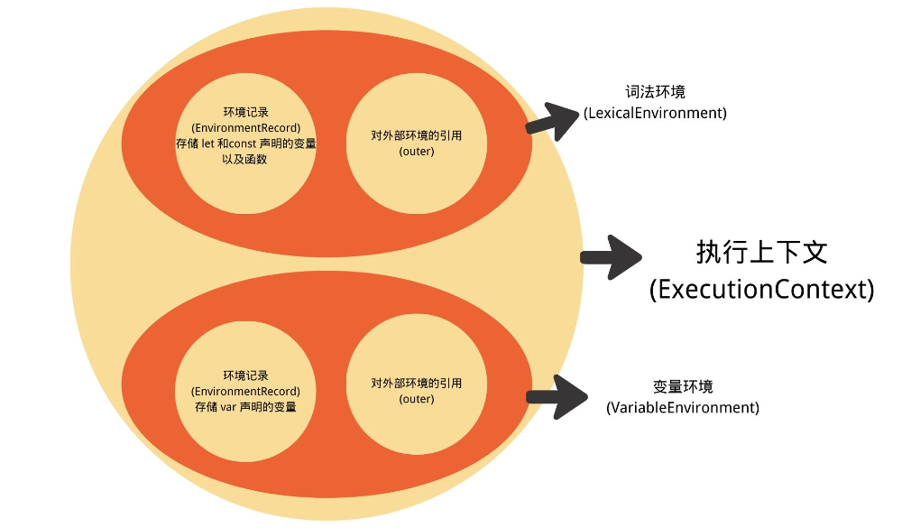
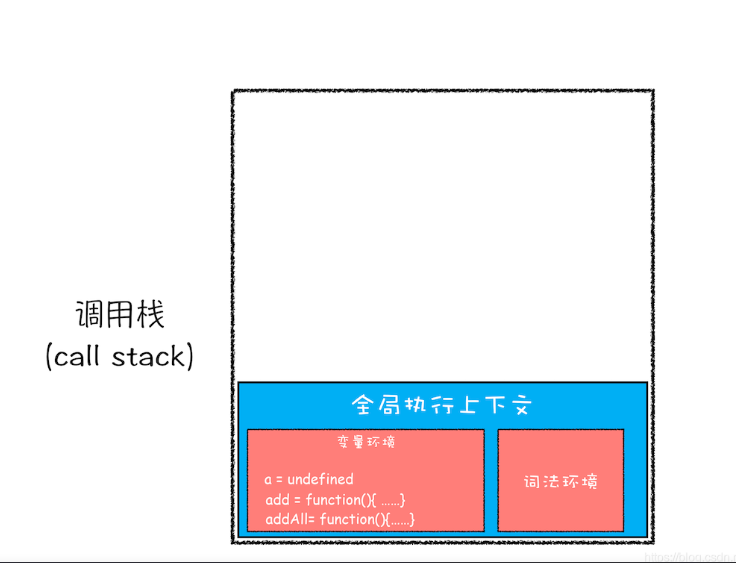
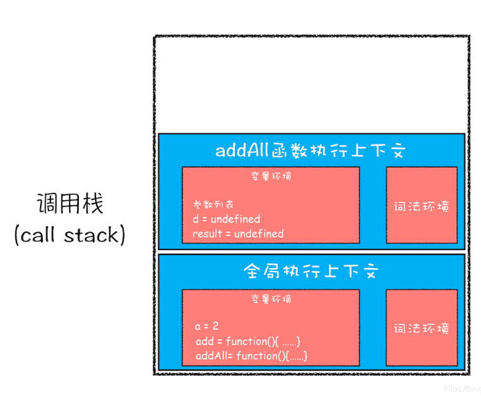
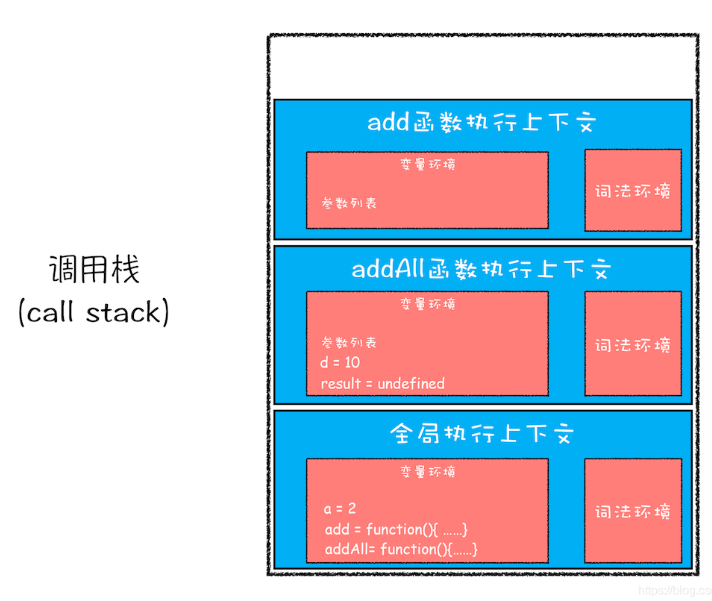
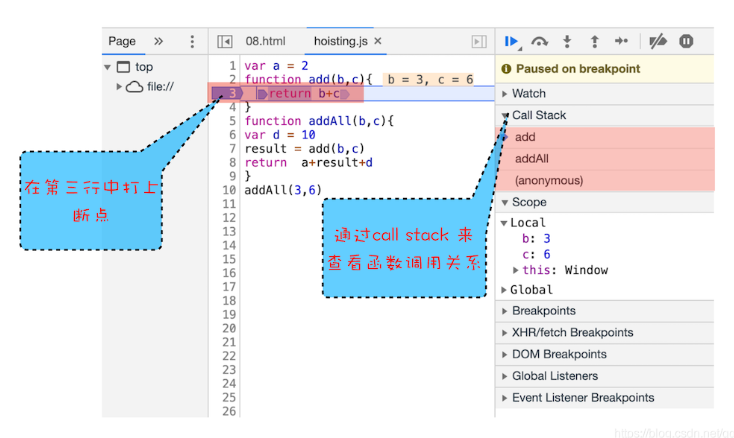
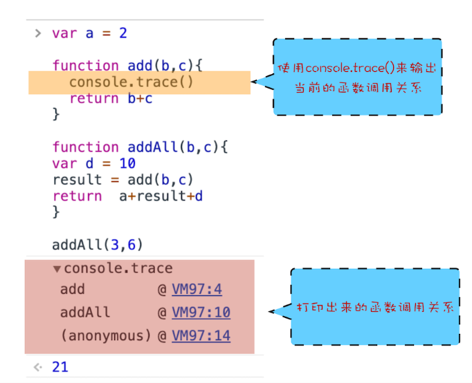

# [JavaScript的执行机制——调用栈](https://blog.csdn.net/qq_44182284/article/details/117084943)

## JavaScript运行机制


## [什么是执行上下文](https://github.com/LinDaiDai/niubility-coding-js/blob/master/JavaScript/%E8%B0%83%E7%94%A8%E5%A0%86%E6%A0%88/JavaScript%E8%BF%9B%E9%98%B6-%E6%89%A7%E8%A1%8C%E4%B8%8A%E4%B8%8B%E6%96%87.md)

执行上下文就是javascript代码被解析和执行时所在环境的抽象概念。每当 Javascript 代码在运行的时候，它都是在执行上下文中运行

执行上下文的类型:
-   **全局执行上下文** — 这是默认或者说基础的上下文，任何不在函数内部的代码都在全局上下文中。它会执行两件事：创建一个全局的 window 对象（浏览器的情况下），并且设置 this 的值等于这个全局对象。一个程序中只会有一个全局执行上下文。
-   **函数执行上下文** — 每当一个函数被调用时, 都会为该函数创建一个新的上下文。每个函数都有它自己的执行上下文，不过是在函数被调用时创建的。函数上下文可以有任意多个。每当一个新的执行上下文被创建，它会按定义的顺序（将在后文讨论）执行一系列步骤。
-   **Eval 函数执行上下文** — 执行在 eval 函数内部的代码也会有它属于自己的执行上下文，但由于 JavaScript 开发者并不经常使用 eval，所以在这里我不会讨论它。

### 执行上下文的生命周期
执行上下文的生命周期也非常容易理解, 分为三个阶段:
1.  创建阶段
2.  执行阶段
3.  销毁阶段

#### 创建阶段
1.  确定this的值, 也就是绑定this (This Binding);
2.  **词法环境(LexicalEnvironment)**组件被创建; (在ES6中提出词法环境和变量环境两个概念)
3.  **变量环境(VariableEnvironment)**组件被创建.



##### This Binding
通过上面的介绍我们知道实际开发主要用到两种执行上下文为全局和函数, 那么绑定this在这两种上下文中也不同.
-   全局执行上下文中, this指的就是全局对象, 浏览器环境指向window对象, nodejs中指向这个文件的module对象.
-   函数执行上下文较为复杂, this的值取决于函数的调用方式. 具体有: 默认绑定、隐式绑定、显式绑定、new绑定、箭头函数.

##### 词法环境

https://stackoverflow.com/questions/23948198/variable-environment-vs-lexical-environment
https://juejin.cn/post/7116095340859621412

**词法环境**是由两个部分**组成**的:
1.  **环境记录**: 存储变量和函数声明的实际位置;
2.  **对外部环境的引用**: 用于访问其外部词法环境.

同样的, **词法环境**也主要有两种类型:
1.  **全局环境**: 拥有一个全局对象(window对象)及其关联的所有属性和方法(比如数组的方法splice、concat等), 同时也包含了用户自定义的全局变量. 但是**全局环境**中没有外部环境的引用, 也就是外部环境引用为null.
2.  **函数环境**: 用户在函数中自定义的变量和函数存储在**环境记录**中, 包含了arguments对象. 而对外部环境的引用可以是**全局环境**， 也可以是另一个**函数环境**(比如一个函数中包含了另一个函数).

##### 变量环境
**变量环境**其实也是一个词法环境, 因此它具有上面定义的词法环境的所有属性.

在 ES6 中，词法 环境和 变量 环境的区别在于前者用于存储**函数声明和变量（ let 和 const ）绑定，而后者仅用于存储变量（ var ）**绑定。

## 什么是 JavaScript 的调用栈 (执行栈)
1.  js代码在运行时可能会产生无数个执行上下文，那么它是如何管理这些执行上下文的呢?
2.  同时由于js是单线程的，所以不能同时干两件事，必须一个个去执行，那么这么多的执行上下文是按什么顺序执行的呢？

管理多个执行上下文靠的就是执行栈，也被叫做调用栈。

**特点**： 后进先出（LIFO）的结构。

**作用**：存储在代码执行期间的所有执行上下文。

-   调用栈一般指的是函数之间的调用关系形成的栈
-   多个嵌套的函数执行时序机制
-   调用栈是 JavaScript 引擎追踪函数执行的一个机制，当一次有多个函数被调用时，通过调用栈就能够追踪到哪个函数正在被执行以及各函数之间的调用关系。

```js
var a = 2
function add(b,c){
  return b+c
}
function addAll(b,c){
var d = 10
result = add(b,c)
return  a+result+d
}
addAll(3,6)
```

1.  第一步，创建全局上下文，并将其压入栈底。从图中你也可以看出，变量 a、函数 add 和 addAll 都保存到了全局上下文的变量环境对象中。全局执行上下文压入到调用栈后，JavaScript 引擎便开始执行全局代码了。首先会执行 a=2 的赋值操作，执行该语句会将全局上下文变量环境中 a 的值设置为 2


1.  第二步，是调用 addAll 函数。当调用该函数时，JavaScript 引擎会编译该函数，并为其创建一个执行上下文，最后还将该函数的执行上下文压入栈中。addAll 函数的执行上下文创建好之后，便进入了函数代码的执行阶段了，这里先执行的是 d=10 的赋值操作，执行语句会将 addAll 函数执行上下文中的 d 由 undefined 变成了 10


1.  第三步，当执行到 add 函数调用语句时，同样会为其创建执行上下文，并将其压入调用栈。当 add 函数返回时，该函数的执行上下文就会从栈顶弹出，并将 result 的值设置为 add 函数的返回值


## 浏览器查看调用栈的信息



## 栈溢出（Stack Overflow）（递归）
现在你知道了调用栈是一种用来管理执行上下文的数据结构，符合后进先出的规则。不过还有一点你要注意，调用栈是有大小的，当入栈的执行上下文超过一定数目，JavaScript 引擎就会报错，我们把这种错误叫做栈溢出。