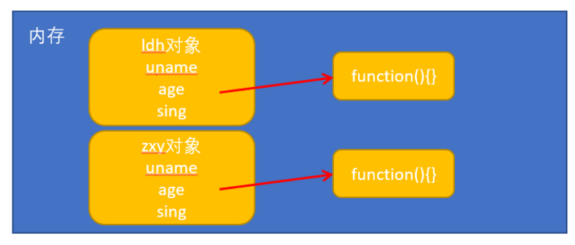
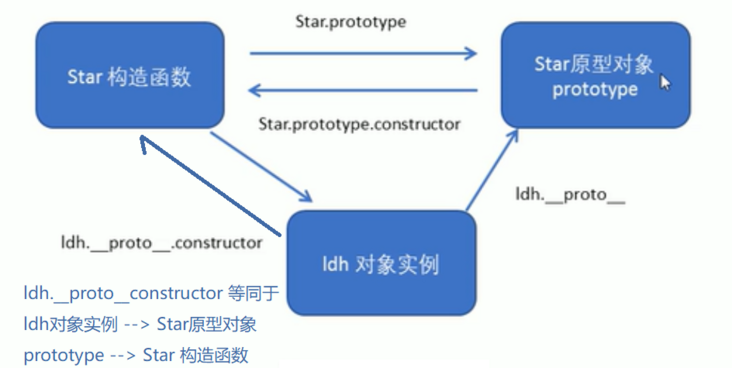
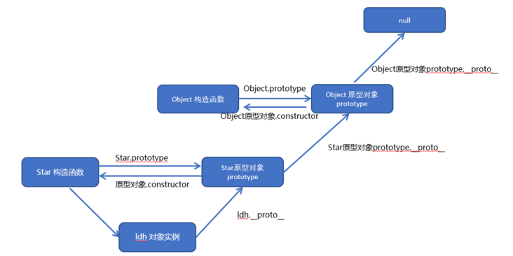

# 类


## ES6之前

类是ES6提出来的  
在 ES6之前 ，对象不是基于类创建的，而是用一种称为**构造函数**的特殊函数来定义对象和它们的特征。

## [构造函数](https://segmentfault.com/a/1190000022776150)

**构造函数**是一种特殊的函数，主要用来**初始化对象**，即为对象成员变量赋初始值，它总与 `new` 一起使用。我们可以把对象中一些公共的属性和方法抽取出来，然后封装到这个函数里面。

```js
    // 创建对象可以通过以下三种方式：
    // 1 对象字面量
    var obj = {}
    
    // 2 new Object()
    var obj = new Object();

    // 3 自定义构造函数
    function Star(name, age) {
        this.name = name;
        this.age = age;
        this.sing = function(){
            console.log('sing')
        }
    }
    let ldh = new Star('刘德华', 18);
```

### 构造函数与普通函数
-   创建方式相同：构造函数也是个普通函数，但是一般来说，构造函数会**采用首字母大写**的方式。
-   调用方式不同，目的不同： 
    -   普通函数： **直接调用**，返回值为函数调用的之后return的值，无return则为空；
    -   构造函数：**需要用new调用**，以创建实例的方式来调用，目的是创建一个指向构造函数的原型的一个实例对象。

### new一个对象的时候，内部发生了什么
1.  首先需要创建一个空对象
2.  将空对象的`__proto__`指向构造函数的prototype（构造函数的原型对象），以此获得原型的方法与属性
3.  将构造函数的this指向这个对象
4.  执行构造函数中的代码
5.  执行构造函数，并返回结果。 如果构造函数返回对象，则返回该对象；否则，返回刚创建的新对象(空对象)。

## 手写new 
[例子](https://jiuto.github.io/jiuto_blog/guide/js/new.html)
[例子](https://juejin.cn/post/6844903704663949325)
```js
    // 简易版
    function _new() {
        // 
        let newObject = new Object()
        // arguments是传入函数的参数，因为是类数组的形式,无法直接使用shift方法
        // 所以使用ES6的新特性进行转换
        // Array.prototype.shift.apply(arguments)用数组原生方法也是可以的
        arguments = Array.from(arguments)
        // 取出构造函数
        let Constructor =  arguments.shift()
        //  获得构造函数的原型对象上的方法与属性
        newObject.__proto__ = Constructor.prototype
        // 绑定this的指向
        Constructor.apply(newObject, arguments)
        return newObject
    }
```

## instanceof

`instanceof` **运算符**用于检测构造函数的 `prototype` 属性是否出现在某个实例对象的原型链上
```js
    function Car(make, model, year) {
        this.make = make;
        this.model = model;
        this.year = year;
    }
    const auto = new Car('Honda', 'Accord', 1998);

    console.log(auto instanceof Car);
    // Expected output: true

    console.log(auto instanceof Object);
    // Expected output: true
```

## 手写instanceof

```js
    function instance_of(L, R) {
        const R_prototype = R.prototype
        let L_proto = L.__proto__
        let flage = false
        while(L_proto !== null) {
            if (L_proto === R_prototype) {
                flage = true
                break
            }
            L_proto = L_proto.__proto__; 
        }
        return flage
    }
```


**构造函数时要注意以下两点**：

1.  构造函数用于创建某一类对象，其**首字母要大写**
2.  构造函数要和 **new 一起使用**才有意义

**new 在执行时会做四件事情**：  

1.  在内存中创建一个新的空对象
2.  让 this 指向这个新的对象
3.  执行构造函数里面的代码，给这个新对象添加属性和方法
4.  返回这个新对象（所以构造函数里面不需要 return ）

**两种方式添加的成员**:  

1.  **静态成员**：在构造函数**本上添加的成员**称为**静态成员**，只能由**构造函数本身来访问**
2.  **实例成员**：在构造函数**内部创建的对象成员**称为**实例成员**，只能由**实例化的对象来访问**

```js
    function Star(name, age) {
        this.name = name;
        this.age = age;
        this.sing = function(){
            console.log('sing')
        }
    }
    // 实例成员就是构造函数内部通过 this 添加的成员 name age sing 就是实例成员。
    // 实例成员只能通过实例化的对象来访问
    let ldh = new Star('刘德华', 18);
    ldh.sing();
    ​
    // 静态成员 在构造函数本身上添加的成员 gender 就是静态成员
    Star.gender = 'male';
    console.log(Star.gender); // 静态成员只能通过构造函数来访问
    console.log(ldh.gender); // 不能通过对象来访问
```

**存在浪费内存的问题**

```js
    function Star(uname, age) {
        this.uname = uname;
        this.age = age;
        this.sing = function() {
            console.log('我会唱歌');
        }
    }
    var ldh = new Star('刘德华', 18);
    var zxy = new Star('张学友', 19);

    console.log(ldh.sing === zxy.sing);   // false

```



当创建实例对象的时候，对于简单的数据类型，直接赋值就可以。  
但对于复杂数据类型，当创建 ldh 这个实例对象的时候，会单独的开辟一块儿空间来存放复杂数据类型 sing 这个方法，创建 zxy 对象的时候，也去开辟一块儿空间来存放 sing 方法。**开辟了两个空间来存放同一个函数**。


### 构造函数原型 prototype
构造函数通过原型分配的函数是所有对象所**共享的**。

JavaScript 规定，**每一个构造函数都有一个 prototype 属性**，指向另一个对象。这个 `prototype` 就是**一个对象**，这个对象的**所有属性和方法**，都会**被构造函数所拥有**。

**我们可以把那些不变的方法，直接定义在 prototype 对象上，这样所有对象的实例就可以共享这些方法。**

一般情况下，**公共的属性**定义到**构造函数里面**，**公共的方法**放在**原型对象身上**


```js
    function Star(name, age){
        this.name = name;
        this.age = age;
    }
    Star.prototype.sing = function() {
        console.log('sing');
    }
    var ldh = new Star('刘德华', 18);
    var zxy = new Star('张学友', 19);
    ldh.sing();
    zxy.sing();
    console.log(ldh.sing === zxy.sing)  // true
```

问答：  
1.  原型是什么 ？  
一个对象，我们也称为 `prototype` 为**原型对象**。
2.  原型的作用是什么 ？  
**共享方法**

### 对象原型 __proto__

**对象都会有一个属性** `__proto__` 指向**构造函数**的 prototype **原型**对象。

-   `__proto__` 对象原型和原型对象 prototype 是等价的
-   `__proto__` 对象原型的意义就在于为**对象的查找机制提供一个方向**，**或者说一条路线**，但是它是一个非标准属性，因此实际开发中，不可以使用这个属性，它只是内部指向原型对象 prototype

## constructor 构造函数

对象原型`__proto__`和**构造函数（prototype）原型对象**里面都有一个属性 `constructor` 属性 `，constructor` 我们称为构造函数，因为它**指回构造函数本身**。

`constructor` 主要用于**记录该对象引用于哪个构造函数**，它可以让原型对象重新指向原来的构造函数


## 构造函数、实例、原型对象三例者之间的关系



## 原型链



1.  只要是对象就有 `__proto__` 原型，指向原型对象
2.  Star 原型对象里面的 `__proto__` 原型 指向的是 `Object.prototype`
3.  `Object.prototype` 原型对象里面的 `__proto__` 原型 指向为 `null`

每一个对象都有一个原型，每一个原型又是一个对象，所以原型又有自己的原型，这样一环扣一环形成一条链，就叫**原型链**。


## JavaScript 的成员查找机制(规则)

1.  当访问一个对象的属性（包括方法）时，首先查找这个**对象自身**有没有该属性。
2.  如果没有就查找它的原型（也就是 `__proto__` 指向的 prototype **原型对象**）
3.  如果还没有就查找原型对象的原型（**Object的原型对象**）。
4.  依此类推一直找到 Object 为止（**null**）。
5.   `__proto__` 对象原型的意义就在于**为对象成员查找机制提供一个方向**，**或者说一条路线**。


## 原型对象 this 指向

构造函数中的this 指向我们实例对象。


##  类

类只是**构造函数**的**语法糖**


## super 扩展类

super 关键字用于访问对象字面量或类的原型（[[Prototype]]）上的属性，或**调用父类的构造函数**

```js
    class Polygon {
        constructor(height, width) {
            this.name = 'Rectangle';
            this.height = height;
            this.width = width;
        }
        sayName() {
            console.log('Hi, I am a ', this.name + '.');
        }
        get area() {
            return this.height * this.width;
        }
        set area(value) {
            this._area = value;
        }
    }

    class Square extends Polygon {
        constructor(length) {
            this.height; // ReferenceError，super 需要先被调用！

            // 这里，它调用父类的构造函数并传入 length
            // 作为 Polygon 的 height, width
            super(length, length);

            // 注意：在派生的类中，在你可以使用 'this' 之前，必须先调用 super()。
            // 现在可以使用 'this' 了，忽略 'this' 将导致引用错误（ReferenceError）
            this.name = 'Square';
        }
    }
```


