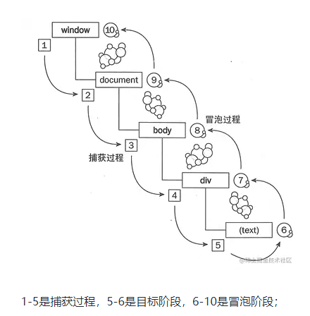

# 事件冒泡与事件捕获

## 事件冒泡 Event bubbling (内到外)
事件会从最内层的元素开始发生，一直向上传播，直到document对象  
`event.stopPropagation()`

## 事件捕获 Event capturing (外到内)
事件会从最外层开始发生，直到最具体的元素  
`event.preventDefault()`

## 事件冒泡和事件捕获过程图：

`element.addEventListener(event, function, useCapture)`

useCapture : 
-   true - 事件句柄在捕获阶段执行（即在**事件捕获阶**段调用处理函数）
-   false- 默认。事件句柄在冒泡阶段执行（即表示在**事件冒泡**的阶段调用事件处理函数）