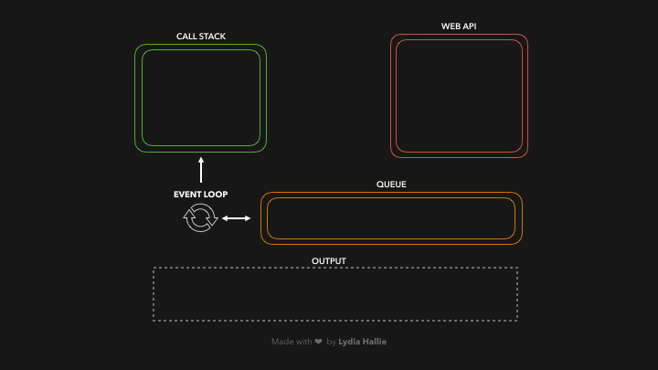

# Event Loop 事件循环

[文章](https://juejin.cn/post/6844903998747574286#heading-3)

## 为什么JavaScript是单线程？

JavaScript的主要用途是与用户互动，以及操作DOM。比如，假定JavaScript同时有两个线程，一个线程在某个DOM节点上添加内容，另一个线程删除了这个节点，这时浏览器应该以哪个线程为准？

## 运行机制
-   JS分为同步任务和异步任务
-   同步任务都在主线程上执行，形成一个**执行栈**
-   主线程之外，事件触发线程管理着一个任务队列，只要异步任务有了运行结果，就在任务队列之中放置一个事件
-   一旦执行栈中的所有同步任务执行完毕（此时JS引擎空闲），系统就会读取任务队列，将可运行的异步任务添加到可执行栈中，开始执行

###  宏任务（macrotask）
可以理解是每次**执行栈**执行的代码就是一个宏任务（包括每次从事件队列中获取一个事件回调并放到执行栈中执行

主代码块，setTimeout、setInterval、I/O、UI 交互事件、postMessage、MessageChannel(优先级是：MessageChannel->setTimeout)、setImmediate(Node.js 环境)

-   每一个task会从头到尾将这个任务执行完毕，不会执行其它
-   浏览器为了能够使得JS内部task与DOM任务能够有序的执行，会在一个task执行结束后，在下一个 task 执行开始前，对页面进行重新渲染 （task->渲染->task->...）

###  微任务（microtask）
可以理解是在当前task执行结束后立即执行的任务

Promise.then、 MutationObserver(优先级小于Promise，
一般是Promise不支持时才会这样做)、 process.nextTick(Node.js 环境,在node环境下，process.nextTick的优先级高于Promise)

-   在当前task任务后，下一个task之前，在渲染之前
-   它的响应速度相比setTimeout（setTimeout是task）会更快，因为无需等渲染
-   在某一个macrotask执行完后，就会将在它执行期间产生的所有microtask都执行完毕（在渲染前）

### 运行机制（进阶）
-   执行一个宏任务（栈中没有就从事件队列中获取）
-   执行过程中如果遇到微任务，就将它添加到微任务的任务队列中
-   宏任务执行完毕后，立即执行当前微任务队列中的所有微任务（依次执行）
-   当前宏任务执行完毕，开始检查渲染，然后GUI线程接管渲染
-   渲染完毕后，JS线程继续接管，开始下一个宏任务（从事件队列中获取）


http://latentflip.com/loupe/?code=JC5vbignYnV0dG9uJywgJ2NsaWNrJywgZnVuY3Rpb24gb25DbGljaygpIHsKICAgIGNvbnNvbGUubG9nKCJIaSEiKTsKICAgIGNvbnNvbGUubG9nKCJDbGljayB0aGUgYnV0dG9uISIpOwogICAgc2V0VGltZW91dChmdW5jdGlvbiB0aW1lcigpIHsKICAgICAgICBjb25zb2xlLmxvZygnWW91IGNsaWNrZWQgdGhlIGJ1dHRvbiEnKTsgICAgCiAgICB9LCAxNTAwMCk7Cn0pOwoK!!!PGJ1dHRvbj5DbGljayBtZSE8L2J1dHRvbj4%3D


https://roadmap.sh/javascript 
思维导图


```js
    const foo = () => console.log("First");
    const bar = () => setTimeout(() => console.log("Second"), 500);
    const baz = () => console.log("Third");

    bar();
    foo();
    baz();
```




