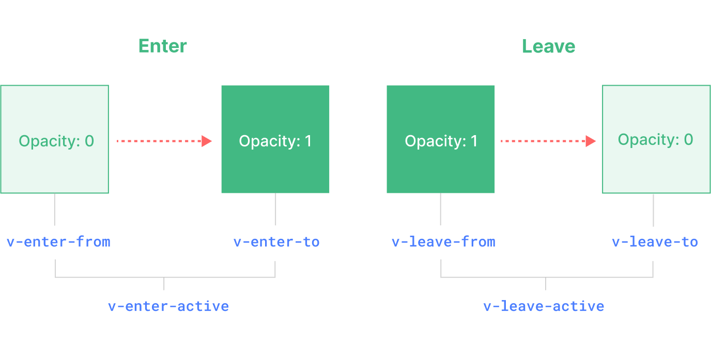

# 内置组件

## Transition

**触发条件**：
-   由 `v-if`所触发的切换
-   由 `v-show` 所触发的切换
-   由特殊元素 `<component>` 切换的动态组件
-   改变特殊的 `key` 属性

**过度流程**：


1.  元素插入之前添加 ： `v-enter-from` `v-enter-active`
2.  元素插入完成后的**下一帧**被添加 (也就是 `v-enter-from` 被移除的同时) ：`v-enter-to`
3.  离开过渡效果被触发时立即添加： `v-leave-from`  `v-leave-active`
4.  离开动画被触发后的**下一帧**被添加 (也就是 `v-leave-from` 被移除的同时) `v-leave-to`

`v-enter-active` 和 `v-leave-active` 给我们**提供**了为进入和离开**动画指定不同速度曲线的能力**
```css
    .fade-enter-active,
    .fade-leave-active {
    transition: opacity 0.5s ease;
    }

    .fade-enter-from,
    .fade-leave-to {
    opacity: 0;
    }
```

### CSS 的 animation
`*-enter-from` 不是在元素插入后立即移除，而是在一个 `animationend` 事件触发时被移除  

默认情况下，`<Transition>` 组件会通过监听过渡**根元素**上的第一个 `transitionend` 或者 `animationend` 事件来尝试自动**判断过渡何时结束**  
```html
    <!-- 嵌套的过渡有delay,需要传duration -->
    <Transition :duration="550">...</Transition>
```


