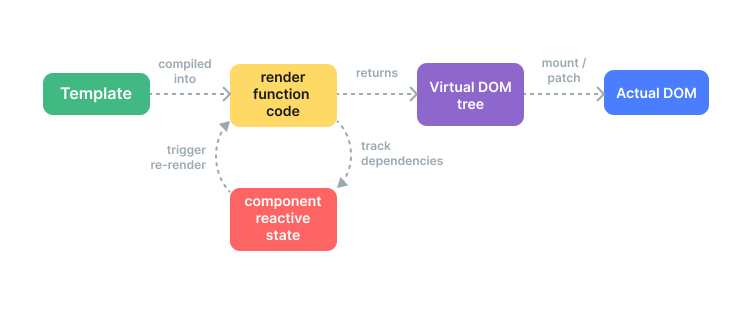

# 渲染机制

## 虚拟 DOM
虚拟 DOM (Virtual DOM，简称 VDOM) 是一种编程概念，意为将目标所需的 UI 通过数据结构“虚拟”地表示出来，保存在内存中，然后将真实的 DOM 与之保持同步。

```js
    const vnode = {
        type: 'div',
        props: {
            id: 'hello'
        },
        children: [
            /* 更多 vnode */
        ]
    }
```
vnode 即一个纯 JavaScript 的对象 (一个“虚拟节点”)，它代表着一个 `<div>` 元素。它包含我们创建实际元素所需的所有信息。它还包含更多的子节点，这使它成为虚拟 DOM 树的根节点。

一个运行时渲染器将会遍历整个虚拟 DOM 树，并据此构建真实的 DOM 树。这个过程被称为**挂载 (mount)**。

如果我们有两份虚拟 DOM 树，渲染器将会有比较地遍历它们，找出它们之间的区别，并应用这其中的变化到真实的 DOM 上。这个过程被称为**更新 (patch)**(又被称为“比对”(diffing) 或“协调”(reconciliation))

虚拟 DOM 带来的主要收益是它让开发者能够灵活、声明式地创建、检查和组合所需 UI 的结构，同时只需把具体的 DOM 操作留给渲染器去处理。

## 渲染管线

1.  **编译**：Vue 模板被编译为**渲染函数**：即用来返回虚拟 DOM 树的函数。这一步骤可以通过构建步骤提前完成，也可以通过使用运行时编译器即时完成。
2.  **挂载**：运行时渲染器调用渲染函数，遍历返回的虚拟 DOM 树，并基于它创建实际的 DOM 节点。这一步会作为响应式副作用执行，因此它会追踪其中所用到的所有响应式依赖。
3.  **更新**：当一个依赖发生变化后，副作用会重新运行，这时候会创建一个更新后的虚拟 DOM 树。运行时渲染器遍历这棵新树，将它与旧树进行比较，然后将必要的更新应用到真实 DOM 上去。


## 模板 vs. 渲染函数
Vue 模板会被预编译成虚拟 DOM 渲染函数; **处理高度动态的逻辑时，渲染函数相比于模板更加灵活**

为什么 Vue 默认推荐使用模板呢？有以下几点原因：

1.  **模板更贴近实际的 HTML**。这使得我们能够**更方便地重用一些已有的 HTML 代码片段**，能够带来**更好的可访问性体验**、能**更方便地使用 CSS 应用样式**，并且**更容易使设计师理解和修改**。
2.  **由于其确定的语法，更容易对模板做静态分析**。这使得 Vue 的模板编译器能够应用许多编译时优化来提升虚拟 DOM 的性能表现 

## React在虚拟DOM上的缺点 （虚拟 DOM 最受诟病）
需要遍历整棵虚拟 DOM 树、比较每个 vnode 上 props 的区别来确保正确性。即使一棵树的某个部分从未改变，还是会在每次重渲染时创建新的 vnode，带来了大量不必要的内存压力。虚拟 DOM 最受诟病： 这种有点暴力的更新过程通过牺牲效率来换取声明式的写法和最终的正确性。

## Vue3 编译器用来提高虚拟 DOM 运行时性能的主要优化

### 静态提升 [例子](https://template-explorer.vuejs.org/#eyJzcmMiOiI8ZGl2PlxuICA8ZGl2PmZvbzwvZGl2PiA8IS0tIGhvaXN0ZWQgLS0+XG4gIDxkaXY+YmFyPC9kaXY+IDwhLS0gaG9pc3RlZCAtLT5cbiAgPGRpdj57eyBkeW5hbWljIH19PC9kaXY+XG48L2Rpdj5cbiIsIm9wdGlvbnMiOnsiaG9pc3RTdGF0aWMiOnRydWV9fQ==)

模板中有部分内容是**不带任何动态绑定的**，Vue 编译器自动地会**提升这部分 vnode 创建函数到这个模板的渲染函数之外**，并在每次渲染时都使用这份相同的 vnode，渲染器知道新旧 vnode 在这部分是完全相同的，所以会**完全跳过对它们的差异比对**。

当有**足够多连续的静态元素时**，它们还会再被**压缩为一个“静态 vnode”**，其中包含的是这些节点相应的纯 HTML 字符串。[例子](https://template-explorer.vuejs.org/#eyJzcmMiOiI8ZGl2PlxuICA8ZGl2IGNsYXNzPVwiZm9vXCI+Zm9vPC9kaXY+XG4gIDxkaXYgY2xhc3M9XCJmb29cIj5mb288L2Rpdj5cbiAgPGRpdiBjbGFzcz1cImZvb1wiPmZvbzwvZGl2PlxuICA8ZGl2IGNsYXNzPVwiZm9vXCI+Zm9vPC9kaXY+XG4gIDxkaXYgY2xhc3M9XCJmb29cIj5mb288L2Rpdj5cbiAgPGRpdj57eyBkeW5hbWljIH19PC9kaXY+XG48L2Rpdj4iLCJzc3IiOmZhbHNlLCJvcHRpb25zIjp7ImhvaXN0U3RhdGljIjp0cnVlfX0=)。
这些静态节点会直接通过 innerHTML 来挂载。同时还会在**初次挂载后缓存相应的 DOM 节点**。如果这部分内容在应用中其他地方**被重用**，那么将会**使用原生的 cloneNode() 方法来克隆新的 DOM 节点**，这会非常高效。

### 更新类型标记 [例子](https://template-explorer.vuejs.org/#eyJzcmMiOiI8ZGl2IDpjbGFzcz1cInsgYWN0aXZlIH1cIj48L2Rpdj5cblxuPGlucHV0IDppZD1cImlkXCIgOnZhbHVlPVwidmFsdWVcIj5cblxuPGRpdj57eyBkeW5hbWljIH19PC9kaXY+Iiwib3B0aW9ucyI6e319)
Vue 在 vnode 创建调用中直接编码了每个元素所需的更新类型

```js
createElementVNode("div", {
  class: _normalizeClass({ active: _ctx.active })
}, null, 2 /* CLASS */)
```
参数` 2 `就是一个**更新类型标记** (patch flag)。**一个元素可以有多个更新类型标记，会被合并成一个数字**。
运行时渲染器也将会使用位运算来检查这些标记，确定相应的更新操作：

```js
    if (vnode.patchFlag & PatchFlags.CLASS /* 2 */) {
    // 更新节点的 CSS class
    }
```

### 树结构打平
内部结构是稳定的一个部分可被称之为一个**区块**。在这个用例中，整个模板只有一个区块，因为这里没有用到任何结构性指令 (比如 v-if 或者 v-for)。

```html
    <div> <!-- root block -->
        <div>...</div>         <!-- 不会追踪 -->
        <div :id="id"></div>   <!-- 要追踪 -->
        <div>                  <!-- 不会追踪 -->
            <div>{{ bar }}</div> <!-- 要追踪 -->
        </div>
    </div>
```
编译的结果会被打平为一个数组，仅包含所有动态的后代节点：  

```html
    div (block root)
    - div 带有 :id 绑定
    - div 带有 {{ bar }} 绑定
```

当这个组件需要重渲染时，只需要遍历这个打平的树而非整棵树。这也就是我们所说的**树结构打平**，**这大大减少了我们在虚拟 DOM 协调时需要遍历的节点数量。模板中任何的静态部分都会被高效地略过**。

`v-if` 和 `v-for` 指令会创建新的区块节点：
```html
    <div> <!-- 根区块 -->
        <div>
            <div v-if> <!-- if 区块 -->
            ...
            <div>
        </div>
    </div>
```

## 对 SSR 激活的影响
更新类型标记和树结构打平都大大提升了 Vue [SSR 激活](https://cn.vuejs.org/guide/scaling-up/ssr.html#client-hydration)的性能表现：
-   单个元素的激活可以基于相应 vnode 的更新类型标记走更快的捷径。
-   在激活时只有区块节点和其动态子节点需要被遍历，这在模板层面上实现更高效的部分激活。